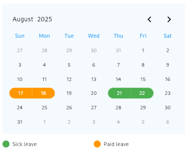
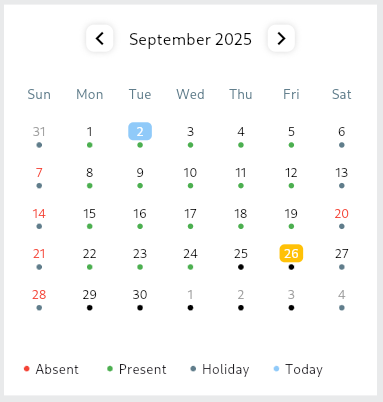

# 📅 Flutter Custom Calendar

A fully customizable **calendar package** for Flutter that supports **all platforms (iOS, Android, Web, Desktop)**.
Easily integrate beautiful and interactive calendars into your apps with flexible **design customization, event management, and multi-platform compatibility**.

---

## ✨ Features

- 📆 **Customizable UI** – Colors, fonts, shapes, and layouts.
- 🎨 **Theming Support** – Custom mode ready.
- 🗓 **Multiple Views** – Month, Week, Day.
- 🔄 **Multi-Platform Support** – Android, iOS, Web, Windows, macOS, Linux.
- ⚡ **Performance Optimized** – Smooth scrolling & rendering.
- 🛠 **Developer Friendly** – Simple APIs and clean architecture.

---

## 🚀 Installation

Add the dependency in your `pubspec.yaml`:

```yaml
dependencies:
  flutter_calenders: ^0.0.2
```

Run:

```sh
flutter pub get
```

---

## 📖 Usage

### 1️⃣ Event Based Calendar

```dart
import 'package:flutter/material.dart';
import 'package:flutter_calenders/flutter_calenders.dart';

class MyCalendarPage extends StatelessWidget {
  @override
  Widget build(BuildContext context) {
    return Scaffold(
      body: Center(
        child: EventBasedCalender(
          margin: EdgeInsets.symmetric(horizontal: 10),
          padding: EdgeInsets.all(10),
          events: [
            Event(
              eventName: 'Sick leave',
              dates: [DateTime(2025, 8, 21), DateTime(2025, 8, 22)],
              color: Colors.green,
            ),
            Event(
              eventName: 'Paid leave',
              dates: [DateTime(2025, 8, 17), DateTime(2025, 8, 18)],
              color: Colors.orange,
            ),
          ],
          primaryColor: Colors.blue,
          backgroundColor: Colors.blue.withValues(alpha: .05),
          chooserColor: Colors.black,
          endYear: 2028,
          startYear: 2020,
          currentMonthDateColor: Colors.black,
          pastFutureMonthDateColor: Colors.grey,
          isSelectedColor: Colors.amber,
          isSelectedShow: true,
          showEvent: true,
          onDateTap: (date) {
            print(date);
          },
        ),
      ),
    );
  }
}
```

---

### 2️⃣ Schedule Based Calendar

```dart
import 'package:flutter/material.dart';
import 'package:flutter_calenders/flutter_calenders.dart';

class MySchedulePage extends StatelessWidget {
  @override
  Widget build(BuildContext context) {
    return Scaffold(
      backgroundColor: Colors.black,
      body: Center(
        child: ScheduleBasedCalender(
          events: [
            Event(
              eventName: 'Sick leave',
              dates: [DateTime(2025, 8, 21), DateTime(2025, 8, 22)],
              color: Colors.green,
            ),
            Event(
              eventName: 'Paid leave',
              dates: [DateTime(2025, 8, 17), DateTime(2025, 8, 18)],
              color: Colors.orange,
            ),
          ],
          currentMonth: 8,
          currentYear: 2025,
          backgroundColor: Colors.white.withValues(alpha: .1),
          monthDateColor: Colors.white.withValues(alpha: .1),
          weekdayColor: Colors.white.withValues(alpha: .1),
          monthTextColor: Colors.white,
          weekdayTextColor: Colors.white,
          isSelectedShow: true,
          isSelectedColor: Colors.deepOrange,
          onDateTap: (date) {
            print(date);
          },
        ),
      ),
    );
  }
}
```

### 2️⃣ Event Based Calendar Theme 2

```dart
import 'package:flutter/material.dart';
import 'package:flutter_calenders/flutter_calenders.dart';

class MyEventPage extends StatelessWidget {
  @override
  Widget build(BuildContext context) {
    return Scaffold(
      backgroundColor: Colors.black,
      body: Center(
        child: EventCalendarTheme2(
              markAllDates: true,
              coloredEvents: [
                Event(
                  eventName: 'Absent',
                  dates: [7, 14, 21, 28, 20].map((e) => DateTime(2025, 9, e)).toList(),
                  color: Colors.red,
                ),
              ],
              margin: EdgeInsets.symmetric(horizontal: 10),
              padding: EdgeInsets.all(10),
              events: [
                Event(
                  eventName: 'Present',
                  dates: [
                    1,
                    2,
                    3,
                    4,
                    5,
                    8,
                    9,
                    10,
                    11,
                    12,
                    15,
                    16,
                    17,
                    18,
                    19,
                    22,
                    23,
                    24,
                  ].map((element) => DateTime(2025, 9, element)).toList(),
                  color: Colors.green,
                ),
              ],
              primaryColor: Colors.blueGrey,
              backgroundColor: Colors.white,
              chooserColor: Colors.black,
              todayColor: Colors.blue.withValues(alpha: .5),
              endYear: 2028,
              startYear: 2020,
              currentMonthDateColor: Colors.black,
              pastFutureMonthDateColor: Colors.grey,
              isSelectedColor: Colors.amber,
              isSelectedShow: true,
              showEvent: true,
              onDateTap: (date) {
                print(date);
              },
            ),
      ),
    );
  }
}
```

---

## 📸 Screenshots

### Event Based Calendar


### Schedule Based Calendar


### Event Based Calendar Thme 2


## 🎨 Customization Options

You can customize:
- **Colors** (primary, background, chooser, event markers, selected date, etc.)
- **Fonts & Styling**
- **Date Ranges** (startYear, endYear)
- **Event Display** (enable/disable, custom colors)

---

## 🤝 Contributing

Contributions are welcome!
1. Fork the repo
2. Create a new branch (`feature/my-feature`)
3. Commit your changes
4. Open a Pull Request 🚀

---

## 📜 License

This project is licensed under the **MIT License**.

---

## 💙 Support

If you like this package, please ⭐ the repo on GitHub and share it with others.
Issues and feature requests are welcome in the [GitHub Issues](../../issues) section.
